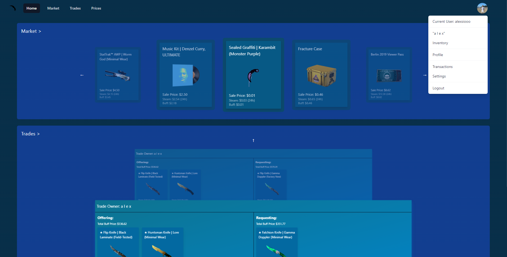
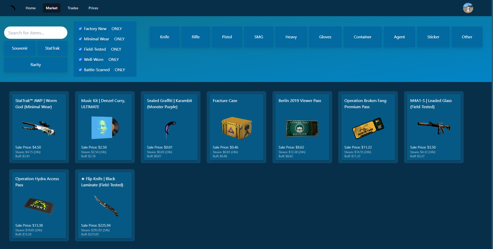
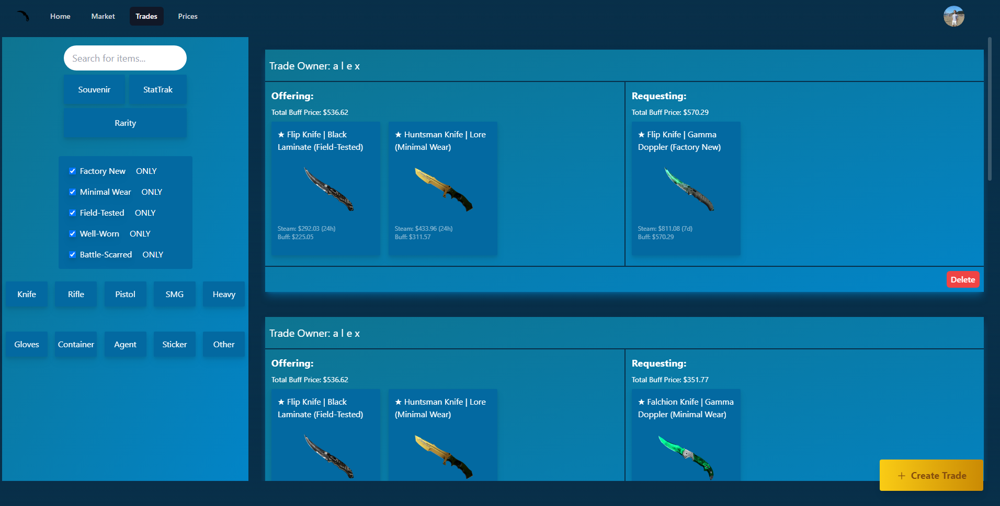
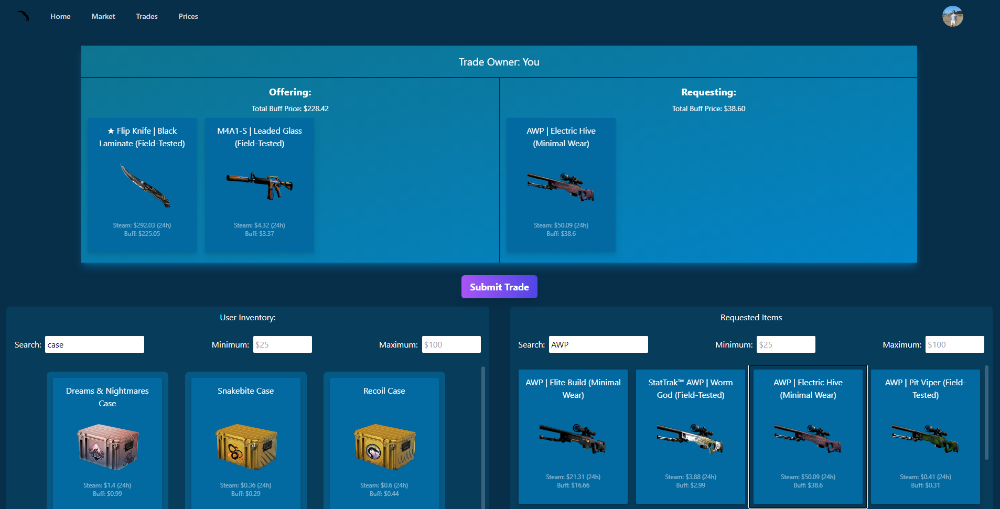
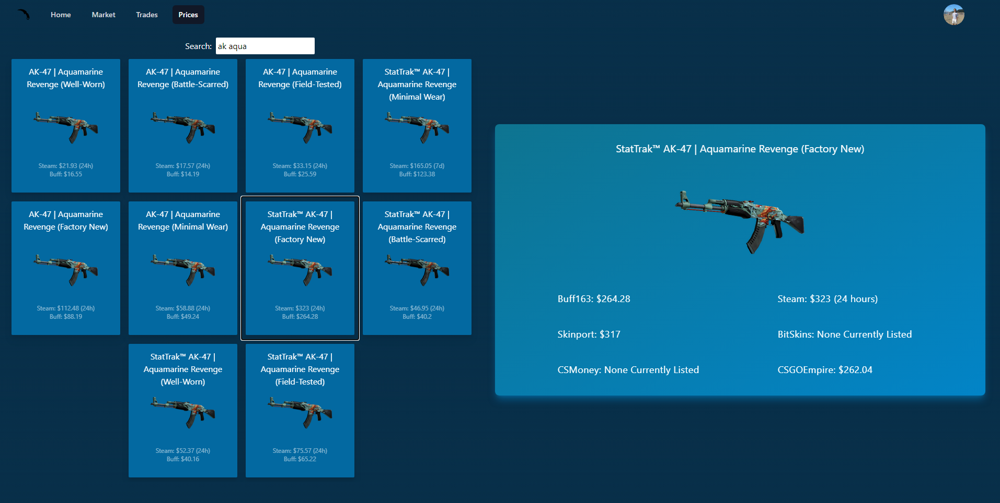
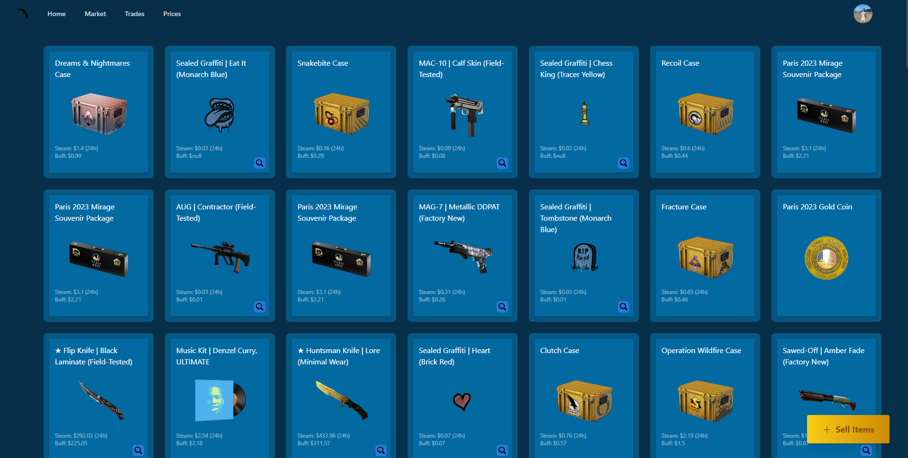

# CSHub
<table>
<tr>
<td>
A sophisticated web application harnessing the Steam API to provide users with seamless access to their inventories. This platform streamlines item management, simplifies sales processes, and fosters trade interactions, thereby optimizing the marketplace experience and enhancing user engagement.
</td>
</tr>
</table>

## Demo
Here is a working live demo :  https://hub-chi-rust.vercel.app/

## Site

### Landing Page

### Market Page

### Trade and Create Trade Pages

### Pricing Page

### Inventory Page

## [Usage](https://hub-chi-rust.vercel.app/) 

### Development
Want to contribute? Great!

To fix a bug or enhance an existing module, follow these steps:

- Fork the repo
- Create a new branch (`git checkout -b improve-feature`)
- Make the appropriate changes in the files
- Add changes to reflect the changes made
- Commit your changes (`git commit -am 'Improve feature'`)
- Push to the branch (`git push origin improve-feature`)
- Create a Pull Request 

### Bug / Feature Request

If you find a bug (the website couldn't handle the query and / or gave undesired results), kindly open an issue [here](https://github.com/alexsio03/hub/issues/new) by including your search query and the expected result.

If you'd like to request a new function, feel free to do so by opening an issue [here](https://github.com/alexsio03/hub/issues/new). Please include sample queries and their corresponding results.

## Built with 

- [Tailwind CSS](https://tailwindcss.com/) - A utility-first CSS framework that makes it easy to design responsive and maintainable websites.

- [Vercel](https://vercel.com/) - A cloud platform for static sites and serverless functions, used for deployment and hosting.

- [React](https://reactjs.org/) - A JavaScript library for building user interfaces, used for front-end development.

- [Next.js](https://nextjs.org/) - A React framework for building server-rendered React applications, used for server-side rendering and routing.

- [Passport.js](http://www.passportjs.org/) - An authentication middleware for Node.js, used for user authentication.

- [Firebase](https://firebase.google.com/) - A cloud-based platform for building web and mobile applications, used for database and authentication.

## To-do
- Implement filter functionality
- Create item-focused pages in market (similar to buff163 systems)
- Add escrow payment system

## Team

  | 
---|---
[Alex Warda](https://github.com/alexsio03) |[Nate Kim](https://github.com/Nate-Kim)

